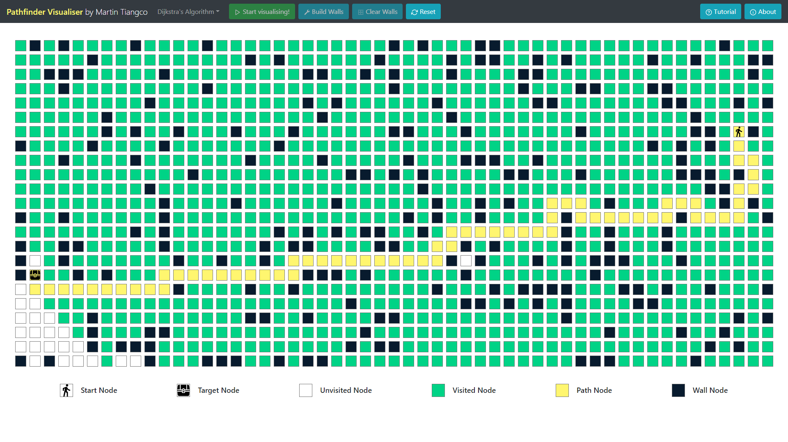

# Pathfinder-Visualiser
Hey, I'm Martin Tiangco! Thanks for looking at my project!

## Live Demo
The Pathfinder Visualiser can be viewed on [this](https://martintiangco.github.io/Pathfinder-Visualiser/) page.

## What is this project?
This project is a visualisation of pathfinding algorithms present in many software applications. The pathfinding algorithms in this project include Breadth-first Search, Depth-first Search and Dijkstra's Algorithm, with more to come in the future. Some practical uses for pathfinding algorithms include video game pathfinding, Google Maps and the internet.

## How does it work?
Initially you will be displayed with an empty 2-dimensional grid with the start and finish nodes. They are where the search starts and finishes respectively and are displayed by the person and the treasure chest icons. You can use the buttons in the navbar to create random walls and clear them. On desktop, you can also use the cursor on the empty squares/nodes and drag it to draw walls. You can also move the start and finish nodes around by clicking and dragging. Once you are happy with the grid, you can select an algorithm and start visualising!

You will see the green nodes slowly fill up the adjacent nodes in the grid - this is the searching part. Once the green nodes find the finish node, then the yellow nodes will display the path the algorithm chose to get there. Note that this is not always the shortest path for Depth-first search. It is the shortest path for some algorithms however (like Dijkstra's and Breadth-first search).

### Features:
- Responsive design for the grid and components - try it out on mobile, tablet and desktop!
- Can generate random walls or draw them
- Can drag the start and finish (on desktop)

### Currently implemented algorithms:
- Djikstra's Algorithm - guaranteed the shortest path!
- Breadth-first Search - guaranteed the shortest path (unweighted)
- Depth-first Search

### Future works:
- Generation of mazes with famous algorithms such as Kruskal and Prim
- More pathfinding algorithms such as A*

## Motivation
I created this project with large inspiration from Clement Mihailescu. After watching his videos, I decided to give this a try - here is the finished product! I am very proud of the application and had a lot of fun building it, and I hope you have a fun time messing around with it. 

## Tech Stack
### Languages/Frameworks:
- HTML, CSS and JavaScript. Used the popular library for JavaScript ReactJS.
- GitHub, deployed on GitHub pages.

### Additional libraries:
- [React Bootstrap](https://react-bootstrap.github.io/) for the different components e.g. navbar, buttons, etc.

## Attributions
Icons I have used in the web application were made by Google and Pixel perfect from www.flaticon.com. 
